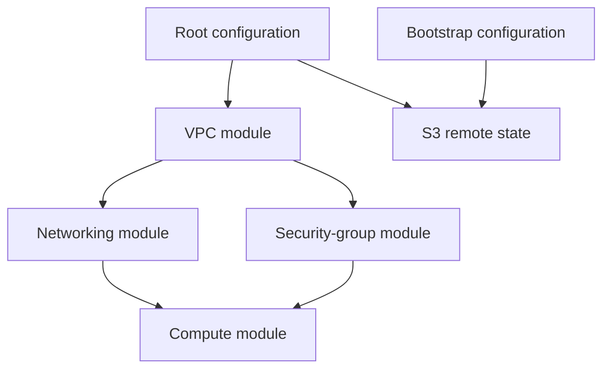
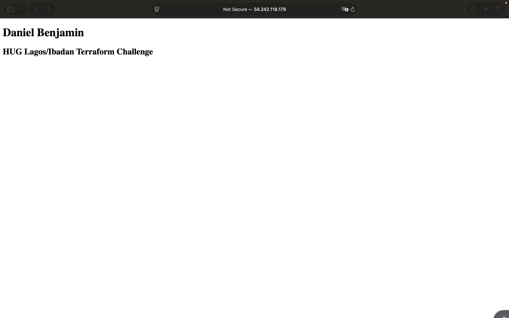
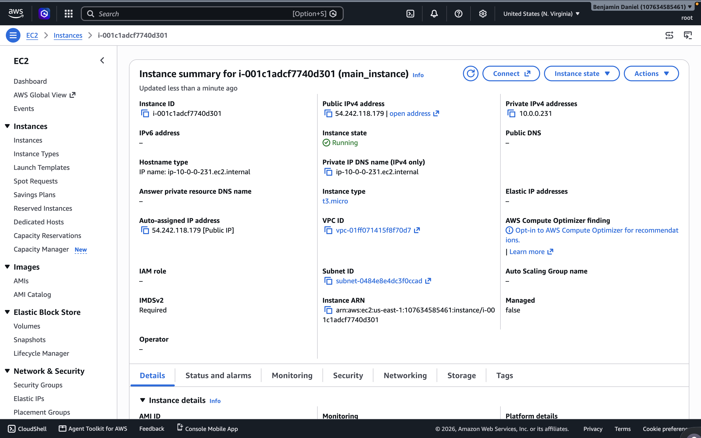
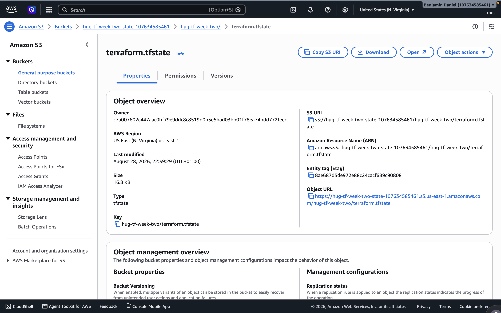

# HUG Lagos/Ibadan Terraform Challenge - Week Two

This project refactors the Week One AWS infrastructure into reusable Terraform modules. It provisions a public Nginx web server and stores the root Terraform state remotely in a protected Amazon S3 bucket.

## Architecture



The application creates:

- A VPC with CIDR `10.0.0.0/16`
- A public subnet with CIDR `10.0.0.0/24`
- An Internet Gateway
- A route table with a default route to the Internet Gateway
- A security group permitting:
  - HTTP on port 80 from the internet
  - SSH on port 22 from the deployer's current public IPv4 address
  - All outbound IPv4 traffic
- An EC2 instance running Nginx
- An S3 bucket for encrypted, versioned, remotely locked Terraform state

## Module structure

The root configuration connects the modules through inputs and outputs:

- The VPC module outputs the VPC ID.
- The networking module consumes the VPC ID and outputs the public subnet ID.
- The security-group module consumes the VPC ID and outputs the security-group ID.
- The instance module consumes the subnet and security-group IDs and outputs the instance's public IP.

## Remote-state design

The S3 backend bucket must exist before Terraform can initialize the root backend. The separate `bootstrap` configuration solves this dependency by creating the bucket first.

The bucket has:

- Server-side encryption using AES-256
- Object versioning for state recovery
- S3 Block Public Access enabled
- Native S3 state locking through `use_lockfile = true`

The bucket name includes the current AWS account ID to make it globally unique. The bootstrap state remains local and is excluded from Git.

This is a short-lived challenge environment, so the bucket uses `force_destroy = true` to support complete cleanup. A long-lived or production state bucket should normally be protected against deletion.

## Prerequisites

Install:

- Terraform 1.10 or newer
- AWS CLI
- GNU Make
- curl

Configure an AWS CLI profile with permission to provision the required VPC, EC2 and S3 resources.

The Makefile uses `terraform-lab` by default. To use another profile, pass it when running Make:

```bash
make setup AWS_PROFILE=my-profile
```

## Deployment

Clone the repository:

```bash
git clone https://github.com/papidb/hug-tf-week-two.git
cd hug-tf-week-two
```

### 1. Bootstrap the remote backend

Run:

```bash
make setup
```

This command:

1. Initializes the `bootstrap` configuration.
2. Creates the encrypted and versioned S3 state bucket.
3. Reads the generated bucket name from the bootstrap output.
4. Initializes the root S3 backend using that bucket.

Review the bootstrap plan and enter `yes` when prompted.

### 2. Plan and deploy the application

Run:

```bash
make deploy
```

The deployment workflow:

1. Formats and validates the Terraform configuration.
2. Retrieves the deployer's current public IPv4 address.
3. Converts the address to a `/32` CIDR for the SSH rule.
4. Saves the Terraform plan as `tfplan`.
5. Applies that exact saved plan.

Review the plan before approving the apply. A new deployment should create the VPC, networking, security-group and compute resources without destroying existing resources.

The public IP is available after deployment:

```bash
terraform output -raw instance_public_ip
```

### 3. Verify the web server

Run:

```bash
make verify
```

This reads the EC2 public IP from the Terraform output and requests:

```text
http://INSTANCE_PUBLIC_IP
```

The response should contain:

```text
Daniel Benjamin
HUG Lagos/Ibadan Terraform Challenge
```

The EC2 user-data script may need a short time to install and start Nginx after the instance first enters the running state.

## Useful individual commands

Run only the planning step:

```bash
make plan
```

Apply the previously saved plan:

```bash
make apply
```

Confirm that Terraform is using remote state:

```bash
terraform state list
```

Inspect the state object in S3:

```bash
bucket=$(terraform -chdir=bootstrap output -raw state_bucket_name)
AWS_PROFILE=terraform-lab aws s3 ls "s3://$bucket/hug-tf-week-two/"
```

## Cleanup

Take the required webpage and AWS Console screenshots before cleanup.

Destroy the application and then the backend bucket:

```bash
make destroy-all
```

The order is deliberate. Terraform first uses the remote state to destroy the application resources. It deletes the S3 backend only after confirming that no application resources remain in state.

The two destruction operations require confirmation. Review each destruction plan carefully before entering `yes`.

## Screenshots

### Webpage


### EC2 instance running


### S3 remote state


## Security decisions

- HTTP is public because the challenge webpage must be reachable from the internet.
- SSH is restricted to the deployer's current public IPv4 address using a `/32` CIDR instead of `0.0.0.0/0`.
- The current IP is discovered at plan time and passed through `TF_VAR_ssh_cidr`, so it is not hardcoded in the repository.
- Terraform state and saved plans are excluded from Git because they may contain infrastructure details or sensitive values.
- The S3 backend is encrypted, versioned, private and protected by state locking.
